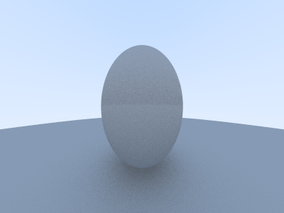

# rtx.go
ray tracing from scratch, based on Peter Shirley's [book](https://raytracing.github.io/), written in Go

### how do I run it
run `make` followed by `build/rtx`

### what do I get

### who is to blame
&copy; 2019 Sayan Goswami

